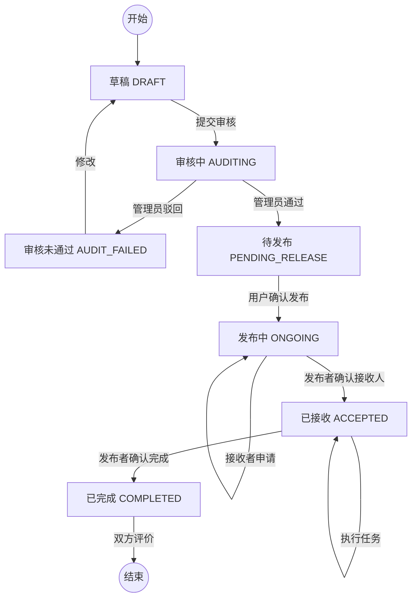

# 校园委托全流程文档

本文档详细描述了当前系统中的委托（任务）全流程，包括状态流转、涉及的角色以及关键的 API 接口。

## 1. 核心实体与状态

### 1.1 核心实体
- **Task (任务)**: 委托的核心实体，包含描述、时间、地点、金额等信息。
- **TaskAcceptRecords (任务接收记录)**: 记录申请接收该任务的用户及状态。
- **Reviews (评价)**: 任务完成后的评价记录。
- **DelegateAuditRecords (审核记录)**: 管理员审核任务的记录。

### 1.2 任务状态 (TaskStatus)
任务在生命周期中会经历以下状态：
1. **DRAFT (草稿)**: 用户创建任务，但尚未提交审核。
2. **AUDITING (审核中)**: 用户提交任务，等待管理员审核。
3. **AUDIT_FAILED (审核未通过)**: 管理员驳回任务。
4. **PENDING_RELEASE (等待发布)**: 审核通过，等待用户确认发布。
5. **ONGOING (委托发布中/进行中)**: 任务已发布，其他用户可申请接收。
6. **ACCEPTED (已接收)**: 发布者确认了接收人，任务正在执行中。
7. **COMPLETED (已完成)**: 任务已完成。
8. **UNFINISHED (未完成)**: 任务未在规定时间内完成。
9. **EXPIRED (已过期)**: 任务过期未被接收。
10. **CANCELLED (已取消)**: 任务被取消。

---

## 2. 详细业务流程

### 阶段一：创建与审核 (Creation & Audit)

1. **创建草稿**
   - **角色**: 发布者 (Owner)
   - **操作**: 填写委托详情（描述、地点、类型等）。
   - **API**: `POST /task/addTaskDraft`
   - **状态变更**: `null` -> `DRAFT`

2. **提交审核**
   - **角色**: 发布者 (Owner)
   - **操作**: 确认无误后，提交任务进行审核。
   - **API**: `PUT /task/auditTask/{id}`
   - **状态变更**: `DRAFT` -> `AUDITING`

3. **管理员审核**
   - **角色**: 管理员 (Admin)
   - **操作**: 查看待审核任务，选择“通过”或“驳回”。
   - **API**: 
     - 允许发布: `PUT /admin/task/allowPublish/{id}` (或类似审核接口)
     - 驳回: 更新状态为 `AUDIT_FAILED`
   - **状态变更**: 
     - 通过: `AUDITING` -> `PENDING_RELEASE`
     - 驳回: `AUDITING` -> `AUDIT_FAILED`

### 阶段二：发布与接收 (Publishing & Acceptance)

4. **确认发布**
   - **角色**: 发布者 (Owner)
   - **操作**: 在审核通过后，正式将任务发布到大厅。
   - **API**: `PUT /user/publisher/confirmTask/{id}`
   - **状态变更**: `PENDING_RELEASE` -> `ONGOING`

5. **申请接收**
   - **角色**: 接收者 (Receiver/Acceptor)
   - **操作**: 浏览任务大厅，选择任务并申请接收（可留言）。
   - **API**: `POST /user/accept` (创建 `TaskAcceptRecords`)
   - **状态变更**: 生成一条 `TaskAcceptRecords`，状态为 `PENDING` (待处理)。

6. **确认接收者**
   - **角色**: 发布者 (Owner)
   - **操作**: 查看申请列表，选择一名接收者进行确认。
   - **API**: `PUT /user/publisher/confirm/{acceptRecordId}`
   - **状态变更**: 
     - 任务状态: `ONGOING` -> `ACCEPTED` (推测，需对应 `confirmTheRecipient` 逻辑)
     - 申请记录状态: 选中者的记录变为 `CHECKED`，其余可能变为 `UNCHECKED`。

### 阶段三：执行与完成 (Execution & Completion)

7. **任务执行**
   - **角色**: 接收者
   - **操作**: 线下或线上完成委托内容。
   - **系统支持**: 可通过 `TaskUpdates` 记录进度（代码中存在 `TaskUpdates` 实体，但流程中未强制）。

8. **确认完成**
   - **角色**: 发布者 (Owner)
   - **操作**: 确认接收者已完成任务。
   - **API**: `PUT /user/publisher/completed/{id}`
   - **状态变更**: `ACCEPTED` -> `COMPLETED`

### 阶段四：评价 (Evaluation)

9. **评价**
   - **角色**: 发布者 / 接收者
   - **操作**: 对本次交易进行评分和评论。
   - **API**: `POST /reviews/addReviews`
   - **数据记录**: 在 `reviews` 表中插入一条记录，包含评分 (`Rating`) 和评论 (`Comment`)。

---

## 3. 流程图示 (Mermaid)

